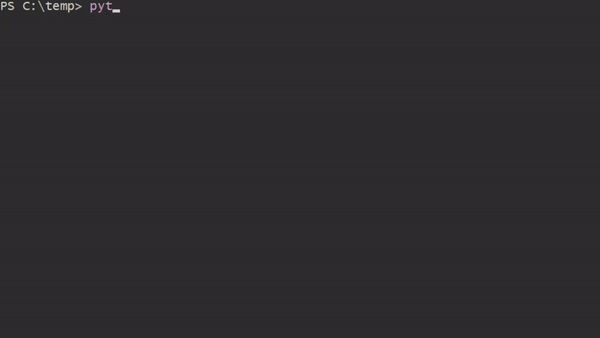

Use this at your own risk

## Basic usage

The script is interactive. It will ask you which usb drive to copy.

## Lessons learned

### Retrieving the size of the disk

The `seek()` function appears to work except when you call `file_handle.seek(0,2)`. This should go to the end of the _file_ and return the total size in bytes. This simply throws an OS Error when you try it on a physical windows drive. (`os.lseek()` has the same behaviour.)

To retrieve the total size you need to read out you can use Windows Management Instrumentation commands. You can retrieve the sector size and the total amount of sectors to read with: 

    wmic diskdrive get DeviceId,TotalSectors,BytesPerSector,Model,InterfaceType

This works, [except that it sometimes doesn't](https://stackoverflow.com/questions/9901792/wmi-win32-diskdrive-to-get-total-sector-on-the-physical-disk-drive#28709238). Windows sometimes lies about the total number of sectors. According to their MSDN documentation.

> Note: the value for this property is obtained through extended functions of BIOS interrupt 13h. The value may be inaccurate if the drive uses a translation scheme to support high-capacity disk sizes. Consult the manufacturer for accurate drive specifications.
> https://docs.microsoft.com/en-us/windows/desktop/CIMWin32Prov/win32-diskdrive

#### workaround

First I read out the reported sectors in large chunks. By default I read 128000 sectors at a time (for 512 sectors this means I read chunks of 62MB). This is really fast.

    sector_read_amount = 128000
    with open(destination, 'wb') as dest_fh:
        i = 0
        while i < sector_total:
            if i + sector_read_amount < sector_total:
                buffer = os.read(disk_fh, sector_len * sector_read_amount)
                i += sector_read_amount
            else:
                rest_sectors = sector_total - i
                buffer = os.read(disk_fh, sector_len * rest_sectors)
                i += rest_sectors
        dest_fh.write(buffer)

And when these large chunks are exhausted I will start reading the unreported sectors one by one until a PermissionError is thrown.

        unreported = 0
        while True:
            try:
                buffer = os.read(disk_fh, sector_len)
                unreported += 1
                dest_fh.write(buffer)
            except PermissionError:
              break

